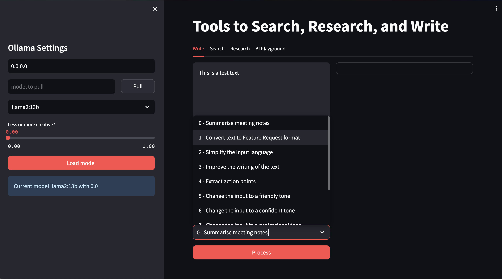

# Solutions Engineer Companion Tool

This is a tool I made to help HashiCorp Solutions Engineers in their day to day work.

## Dependencies

### Hardware recommended
Mac with M1 Pro

### Software dependencies
 - Ollama - https://ollama.com/
 - Docker
 - Github access, to clone this repo
 - Python 3.11

## Usage

1. Clone the repo
2. Go to https://ollama.com/library and download some models. For example:
    * `ollama pull mistral:7b`
    * `ollama pull llama3:8b`

### With Docker

1. Have Ollama running -> see `run_ollama.sh`.
2. Set `OLLAMA_HOST` in `docker-compose.yaml` to the IP of your machine.
3. Run `docker compose up -d`.

*Note: Once I have a docker container published, this will be easier*

### Without docker

1. Have Ollama running -> see `run_ollama.sh`
2. Run from source with `run_streamlit.sh`

## Creating embeddings

The quality of the answers only goes as far as the quality of the LLM, prompt and embeddings.

For RAG, create embeddings with the `run_embed.sh` script or, if you work for HashiCorp, contact me directly.

See `run_embed.sh` and edit the environment variables accordingly.
