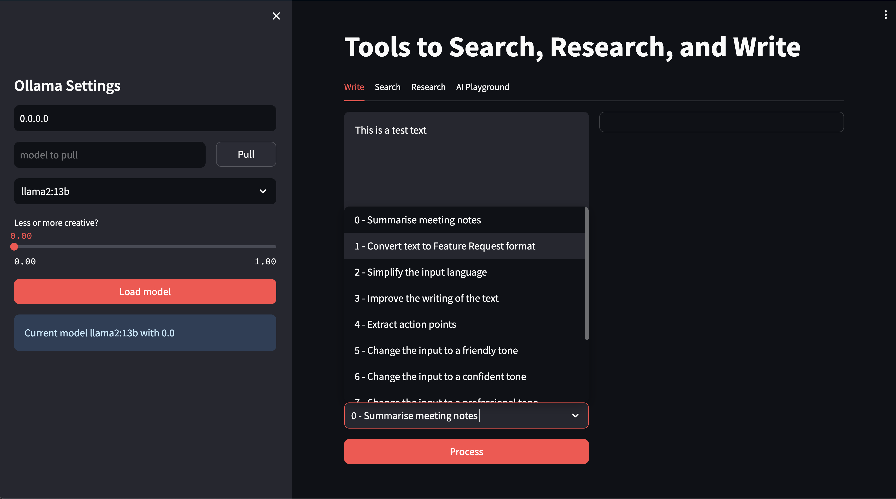

# Solutions Engineer Companion Tool

This is a tool I made to help HashiCorp Solutions Engineers in their day-to-day work.
It supports the following use cases:
- Helping to write self-reflections, Feature Requests or generally improve writing.
- Perform RAG on custom documents. Please see inside `./docs` for further instructions.
- Perform RAG on public website information, created via the `run_embed.sh` script.

## Dependencies

### Hardware recommended
Mac with M1 Pro

### Software dependencies
 - Ollama - https://ollama.com/
 - Docker
 - Github access, to clone this repo
 - Python 3.11

## Usage

1. Clone the repo
2. Go to https://ollama.com/library and download some models. For example:
    * `ollama pull mistral:7b`
    * `ollama pull llama3:8b`

### With Docker

1. Have Ollama running -> see `run_ollama.sh`.
2. Set `OLLAMA_HOST` in `docker-compose.yaml` to the IP of your machine.
3. Run `docker compose up -d`.

*Note: Once I have a docker container published, this will be easier*

### Without docker

1. Have Ollama running -> see `run_ollama.sh`
2. Run from source with `run_streamlit.sh`

### Configuration

- `OLLAMA_HOST` - the Ollama server to use. It can also be changed in the app's sidebar.
- `LLM_MAX_CONTEXT` - the largest context window, in tokens, requested from Ollama (default `8192`). The app uses the model's own context length up to this limit. Ollama's memory use grows with the context window, so lower it on small GPUs, or raise it for longer documents.

### NVIDIA GPUs

The PyTorch wheels are built for CUDA 13, which needs NVIDIA driver 580 or newer. With an older driver the embeddings run on the CPU, and the app logs a warning.

## Using own documentation

You can drop multiple files into the `./docs` folder and the app will load and create temporary in-memory embeddings for them, when loading the LLM. Currently supported file extensions are:

- csv
- pdf
- docx (doc needs [LibreOffice](https://www.libreoffice.org/) installed)
- pptx (ppt needs [LibreOffice](https://www.libreoffice.org/) installed)
- xls or xlsx
- md or mdx

LibreOffice is not included in the Docker image, so convert `.doc` and `.ppt` files to `.docx` and `.pptx` before using them there.

## Creating embeddings

The quality of the answers only goes as far as the quality of the LLM, prompt and embeddings.

For RAG, create embeddings with the `run_embed.sh` script or, if you work for HashiCorp, contact me directly.

See `run_embed.sh` and edit the environment variables accordingly.
